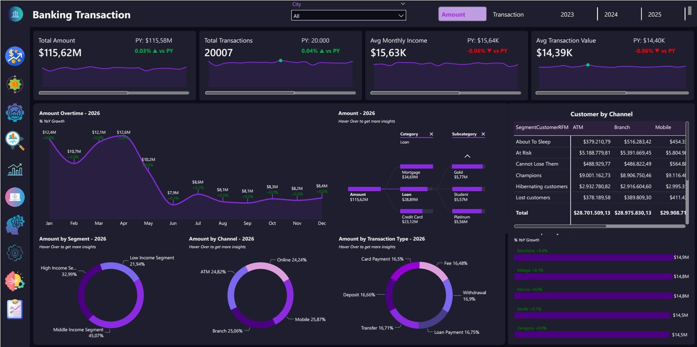
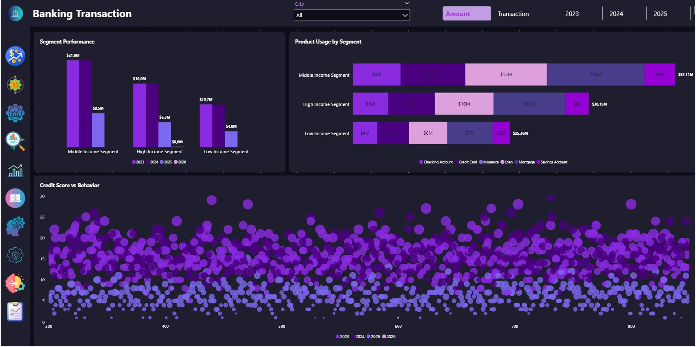
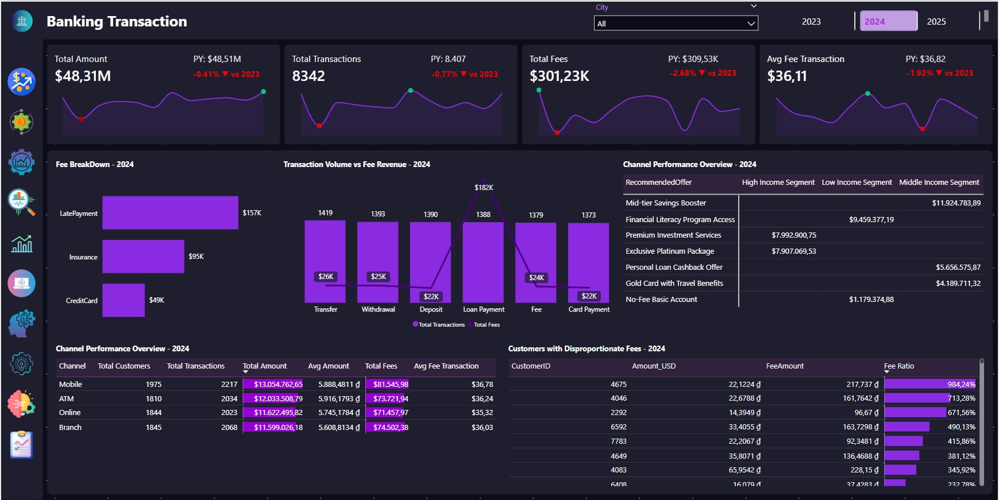
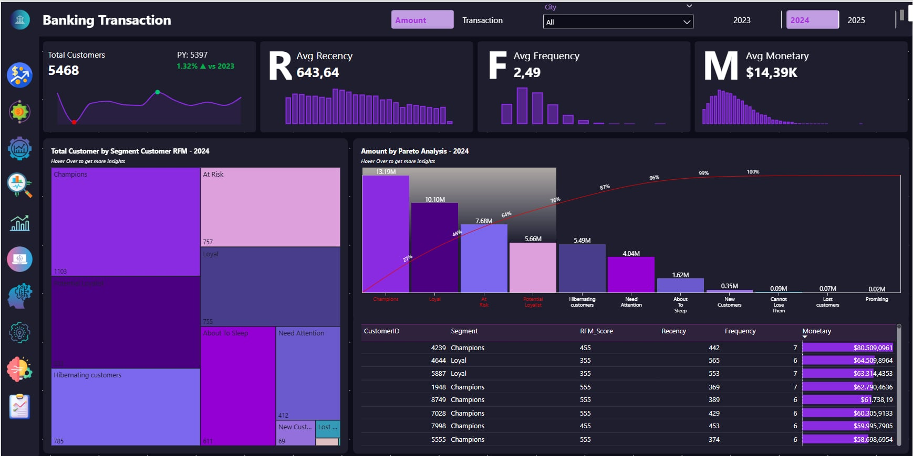
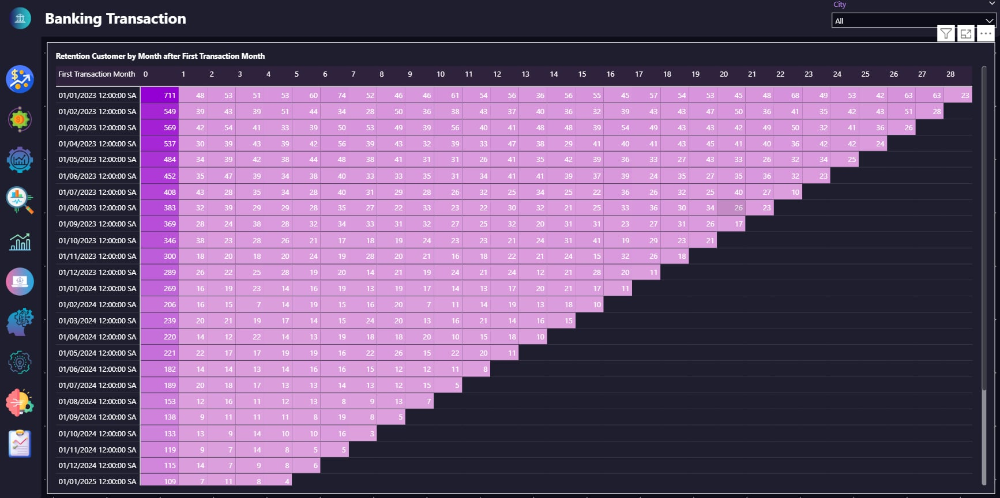
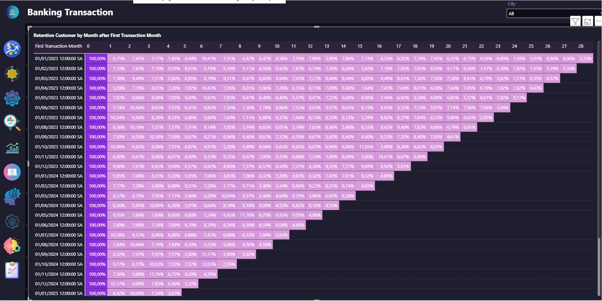
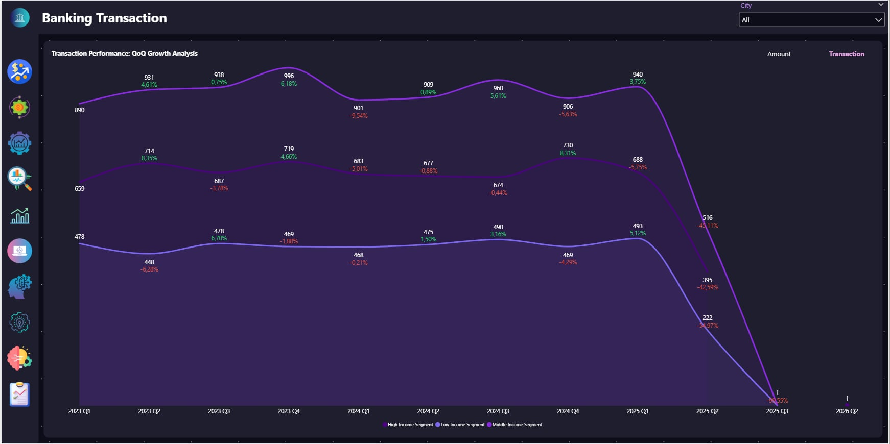
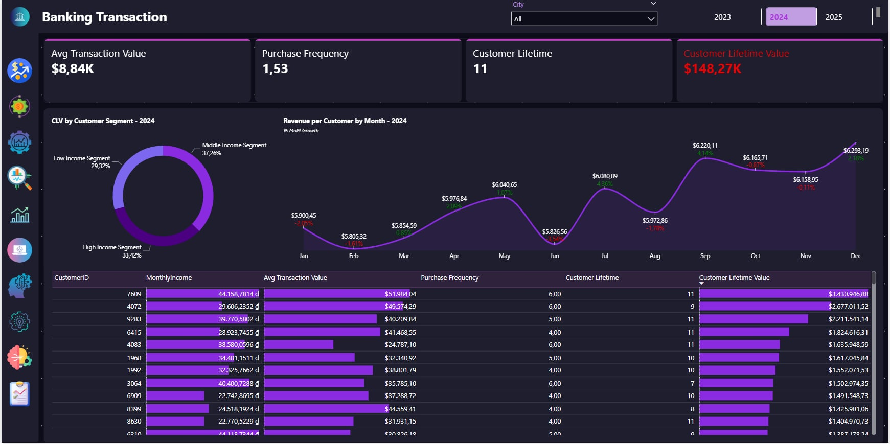
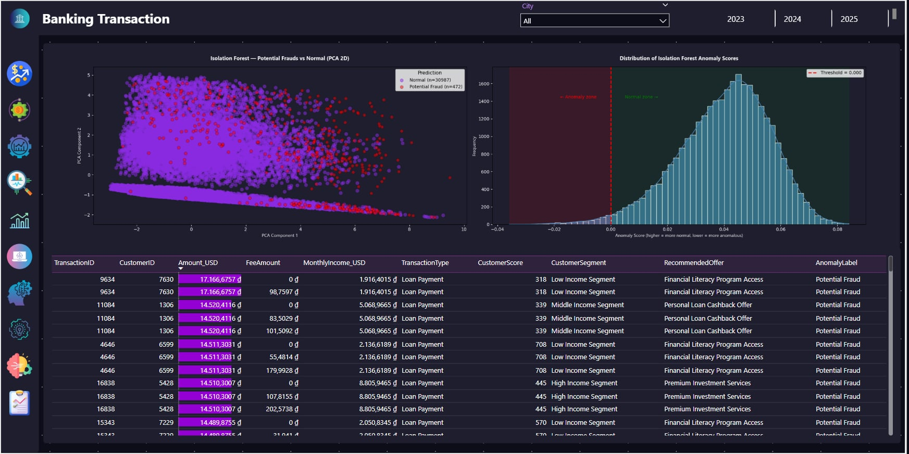
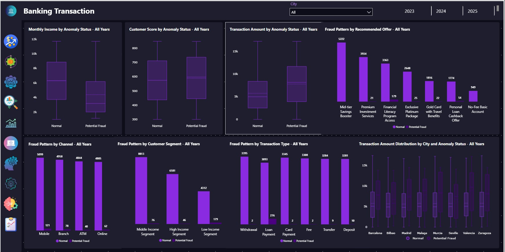

# Power BI — Graduation Banking Dashboard

File báo cáo: [`bank_transaction.pbix`](bank_transaction.pbix)  
Nguồn dữ liệu: SQL Server — database `GraduationBanking` (`dbo.Transactions`, `dbo.RankRFM`, `dbo.IsolationOutput`).

---

## Tổng quan dashboard

Báo cáo gồm **9 nhóm trang phân tích** và **phần insight / khuyến nghị**, hỗ trợ theo dõi giao dịch, hành vi khách hàng, doanh thu/phí, RFM, cohort, QoQ, CLV và phát hiện bất thường (Isolation Forest & LOF).

---

## 📊 Tổng quan (Overview)

**Mục đích:** Cung cấp cái nhìn tổng thể về hoạt động giao dịch.

**Nội dung chính:**

- Chỉ số tổng hợp: tổng giá trị giao dịch, tổng số giao dịch, thu nhập bình quân tháng, giá trị giao dịch trung bình.
- Xu hướng giao dịch theo tháng: biến động và tăng trưởng so với cù kỳ (YoY).
- Phân tích theo phân khúc khách hàng, loại giao dịch và kênh (Branch, ATM, Mobile, Online).
- Phân bố địa lý giao dịch và các thành phố có hiệu suất cao.
- Hỗ trợ nhận diện mẫu chi tiêu, hành vi khách hàng và dấu hiệu bất thường theo segment và vùng miền.

---

## 👥 Insight khách hàng (Customer Insight)

**Mục đích:** So sánh hành vi và giá trị giữa các nhóm khách hàng.

**Nội dung chính:**

- Hiệu suất phân khúc theo năm: nhóm thu nhập trung bình, cao và thấp.
- Mức độ sử dụng sản phẩm theo phân khúc (vay, thẻ tín dụng, tiết kiệm, …).
- Mối quan hệ giữa điểm tín dụng (credit score) và hành vi — phát hiện tín hiệu rủi ro.
- So sánh phân bố giá trị khách hàng và mức độ tương tác giữa các segment.
- Hỗ trợ phát hiện bất thường hành vi và xu hướng đặc thù từng nhóm.

---

## 💰 Doanh thu & hành vi (Revenue & Behavior)

**Mục đích:** Phân tích cấu trúc doanh thu từ giao dịch và phí.

**Nội dung chính:**

- Tổng quan: tổng số tiền, tổng giao dịch, tổng phí, phí trung bình mỗi giao dịch.
- Tách các thành phần phí: trả chậm, bảo hiểm, thẻ tín dụng — xác định nguồn doanh thu chính.
- So sánh khối lượng giao dịch và doanh thu phí theo loại giao dịch — hiệu quả và lợi nhuận.
- Hiệu suất offer/sản phẩm theo doanh thu.
- Đánh giá kênh (ATM, Branch, Mobile, Online) theo khách hàng, số giao dịch, số tiền và phí.
- Gợi ý tối ưu doanh thu, cơ cấu phí và kênh phân phối.

---

## 👥 Phân tích RFM (RFM Analysis)

**Mục đích:** Phân khúc khách hàng theo Recency, Frequency, Monetary.

**Nội dung chính:**

- Tổng quan cơ sở khách hàng và ba chỉ số R, F, M.
- Gán nhóm: Champions, Loyal, At Risk, Potential Loyalists, Hibernating, …
- Phân bố khách hàng theo segment — nhóm giá trị cao và nhóm có nguy cơ rời bỏ.
- Phân tích Pareto (80/20): segment đóng góp doanh thu lớn nhất.
- Chi tiết điểm RFM từng khách — insight hành vi sâu hơn.
- Hỗ trợ giữ chân khách, tái kích hoạt và quản lý tập trung doanh thu.

---

## 📅 Phân tích cohort (Retention Customer)

**Mục đích:** Theo dõi khả năng giữ chân khách theo cohort (tháng giao dịch đầu tiên).

**Nội dung chính:**

- Retention theo cohort sau tháng giao dịch đầu tiên.
- Tỷ lệ giữ chân theo thời gian — mức suy giảm tương tác qua các tháng.
- Cả tỷ lệ % và số khách hàng tuyệt đối.
- So sánh cohort — giai đoạn retention mạnh/yếu.
- Nhận diện vòng đời khách hàng, churn và cơ hội cải thiện retention.

---

## 📊 Phân tích QoQ (Quarter over Quarter)

**Mục đích:** Theo dõi tăng trưởng giá trị giao dịch theo quý.

**Nội dung chính:**

- Tăng trưởng QoQ theo giá trị giao dịch và phân khúc khách hàng.
- So sánh nhóm thu nhập cao, trung bình, thấp theo thời gian.
- Xu hướng tăng/giảm, giai đoạn tăng tốc hoặc suy thoái.
- Đóng góp từng segment vào doanh thu tổng.
- Phát hiện tính mùa vụ, biến động segment và tín hiệu suy giảm.

---

## 💎 Phân tích CLV (Customer Lifetime Value)

**Mục đích:** Đo lường giá trị trọn đời khách hàng.

**Nội dung chính:**

- Chỉ số: giá trị giao dịch TB, tần suất mua, thời gian sống khách hàng, CLV.
- CLV theo phân khúc — khác biệt thu nhập thấp / trung bình / cao.
- Doanh thu trên mỗi khách theo tháng — xu hướng và tăng trưởng.
- Hành vi cấp khách: thu nhập, giao dịch, đóng góp trọn đời.
- Xác định khách hàng giá trị cao và driver doanh thu.
- Tối ưu retention, targeting và tối đa hóa giá trị dài hạn.

---

## 🌲 Isolation Forest — Phân tích bất thường

**Mục đích:** Phát hiện giao dịch bất thường bằng học máy không giám sát (kết quả đồng bộ với `dbo.IsolationOutput` từ notebook).

**Nội dung chính:**

- So sánh hành vi giao dịch **bình thường** vs **bất thường** (số tiền, phí, thu nhập, …).
- Phân bố theo loại giao dịch, kênh, sản phẩm, địa điểm.
- Trực quan PCA 2D — tách cụm giao dịch đáng ngờ.
- Phân bố điểm anomaly — ngưỡng phân biệt fraud / normal.
- Profiling khách hàng liên quan anomaly.

---

## 🔬 Local Outlier Factor (LOF) — Phân tích bất thường

**Mục đích:** Bổ sung Isolation Forest — phát hiện outlier theo **mật độ cục bộ**.

**Nội dung chính:**

- LOF đo độ lệch so với hàng xóm trong không gian đặc trưng.
- So sánh normal vs anomaly trên nhiều biến.
- Phân bố theo loại GD, kênh, sản phẩm, vị trí.
- PCA 2D — cụm giao dịch nghi ngờ.
- Điểm LOF cao hơn → khả năng bất thường mạnh hơn.
- Bắt được pattern **tinh tế, cục bộ** mà mô hình global có thể bỏ sót.

---

## 💡 Insight & khuyến nghị

### 🔍 Tổng hợp hành vi gian lận — Isolation Forest

| Phát hiện | Ý nghĩa |
|-----------|---------|
| Giao dịch bất thường có **số tiền và phí cao hơn** rõ rệt | Tín hiệu anomaly mạnh |
| Tập trung cao ở **Loan Payment** | Pattern fraud tương đối tách biệt |
| Rủi ro cao ở sản phẩm **Loan** và **Credit Card** | Tập trung theo sản phẩm |
| Phân bố **đều** trên kênh và địa lý | Không phụ thuộc kênh/vùng |
| Khách anomaly có thu nhập **hơi thấp** | Tín hiệu yếu |
| Xuất hiện ở **mọi segment**, hơi nhiều ở nhóm thu nhập TB/thấp | Không giới hạn một segment |
| Pattern **cực đoan, dễ tách** | Phù hợp mô hình phát hiện global |

### 🔍 Tổng hợp hành vi gian lận — Local Outlier Factor

| Phát hiện | Ý nghĩa |
|-----------|---------|
| Số tiền và phí cao hơn nhưng **chồng lấn** nhiều hơn IF | Bất thường “mềm” hơn |
| Phân bố **rộng** hơn theo loại GD; đỉnh vừa ở Loan Payment | Pattern đa dạng hơn |
| Kênh và địa lý **đều** — không phụ thuộc geography/channel | Giống IF |
| Loan & Credit Card vẫn nổi bật | Rủi ro theo sản phẩm (mức vừa) |
| Khách anomaly **thu nhập thấp hơn** | Stress tài chính — tín hiệu mạnh hơn |
| Nhóm thu nhập **thấp/TB** nhiều hơn | Segment risk bổ sung |
| Pattern **cục bộ, tinh tế** | Bắt lệch hành vi, không chỉ outlier cực đoan |

### 💡 Kết luận chính (Key Takeaways)

1. Gian lận/bất thường đến từ **cả outlier cực đoan và lệch hành vi tinh tế** — nên dùng kết hợp IF + LOF.
2. Giao dịch **liên quan vay (Loan)** và **cấu trúc phí** là chỉ báo mạnh nhất.
3. **Không phụ thuộc** địa lý hay kênh giao dịch.
4. **Thu nhập và phân khúc** là tín hiệu bổ sung, không phải yếu tố duy nhất.
5. Hai mô hình bổ sung nhau: IF nhấn cực trị global, LOF nhấn ngữ cảnh local.

---

